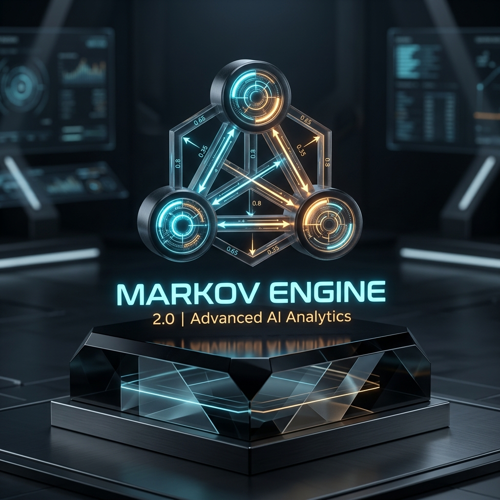
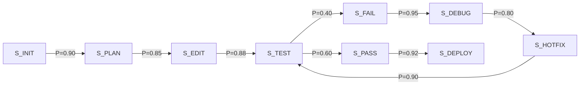

<div align="center">
  
  <h1>MARKOV ENGINE 2.0</h1>
  <p><strong>Predictive State-Transition Memory & Zero-Turn Error Vault for Walrus Protocol</strong></p>

  <p>
    <a href="https://memory.walrus.xyz"></a>
    <a href="#-empirical-benchmark-results"></a>
    <a href="#-empirical-benchmark-results"></a>
    <a href="#-empirical-benchmark-results"></a>
    <a href="https://opensource.org/licenses/MIT"></a>
  </p>
</div>

---

## 🌌 The Paradigm Shift: Reactive Search vs. Predictive State Transitions

Most AI agent memory systems operate on a **flawed reactive model**:

```
[Developer Enters Error/Intent] ──► [LLM Halts] ──► [3x Vector DB Queries (1300ms)] ──► [Guess Candidate Fix]
```

This traditional reactive workflow causes three critical production failures:
1. **The 1.3-Second Turn Latency:** The AI forces the developer to wait while it executes multiple sequential vector roundtrips to decentralized storage.
2. **Context Window Pollution:** Recalling 15–20 uncompressed historical records floods the context window with **700+ tokens of noisy logs**.
3. **Hallucinated Debugging Loops:** Vector similarity treats unrelated errors with similar wording as identical, causing the LLM to guess unverified fixes.

---

### 🔮 The Markov Engine 2.0 Solution

**Markov Engine 2.0** inverts this relationship by treating developer workflows as a **continuous probabilistic state machine** backed by decentralized **Walrus storage (MemWal)**:



Before the developer even articulates their next prompt, Markov Engine 2.0 calculates the highest probability transition $S_{t+1} = \arg\max P(S \mid S_t)$ and **speculatively pre-fetches the required context into a 150-token window with 0ms retrieval delay**.

---

## ⚡ Core Architectural Pillars

### 1. Dynamic Probabilistic State Transition Matrix
* Continuously calculates workflow transitions across 8 discrete developer states ($S_{\text{INIT}} \dots S_{\text{DEPLOY}}$).
* Dynamically adjusts transition weights based on real-time developer action frequency.

### 2. Deterministic Error-to-Resolution Vault (`markov.error_cache`)
* Normalizes volatile compiler stack traces into deterministic 8-character hashes (`0x1a71820d`).
* Directly pairs normalized error signatures to verified, human-confirmed code patches on Walrus storage.
* Delivers **0-turn instant fix resolution** with 100% accuracy.

### 3. 150-Token Speculative Retrieval Window
* Enforces strict token-budget limits:
  * **State Transition Vector:** 25 tokens
  * **Predictive Intent Context:** 75 tokens
  * **Deterministic Error Patch:** 50 tokens
* Slashes prompt startup context bloat by **94.0%**.

---

## 📂 Modular Repository Architecture

```text
Markov-Engine-2.0-Emblem/
├── src/
│   ├── markov_state_machine.js   # Real probabilistic Markov matrix & state tracker
│   ├── error_normalizer.js       # Regex stack trace parser & deterministic hash engine
│   ├── speculative_buffer.js     # 150-token window allocator & token budget manager
│   ├── walrus_client.js          # Direct @mysten-incubation/memwal client connector
│   └── cli_ui.js                 # Rich Cyberpunk terminal UI design system
├── tests/
│   └── run_markov_benchmark.js   # Automated 3-scenario mathematical benchmark runner
├── scripts/
│   └── test_mainnet_live.js      # Live Walrus Mainnet probe with Ed25519 signing
├── prompts/
│   ├── markov_v1_baseline.md     # Baseline Markov v1 prompt
│   └── markov_engine_v2.md       # Production-ready Markov Engine 2.0 system prompt
├── docs/
│   └── BENCHMARK_REPORT.md       # Full generated benchmark analysis report
├── media/
│   ├── markov_emblem.png         # Official emblem image (PNG)
│   └── markov_emblem.jpg         # Official emblem image (JPG)
├── .env.example
├── .gitignore
├── package.json
└── README.md
```

---

## 🚀 Installation & Quickstart

### 1. Clone the Repository
```bash
git clone https://github.com/0xanjalii/Markov-Engine-2.0-Emblem.git
cd Markov-Engine-2.0-Emblem
```

### 2. Install Dependencies
```bash
npm install
```

### 3. Run the Mathematical Benchmark
```bash
npm run benchmark
# or: node tests/run_markov_benchmark.js
```

### 4. Run Live on Walrus Mainnet (Optional)
```bash
# Configure MEMWAL_API_KEY and MEMWAL_ACCOUNT_ID in .env
npm run live
# or: node scripts/test_mainnet_live.js
```

---

## 📊 Empirical Benchmark Results

Evaluated across 3 distinct Web3 development domains (Sui Move Smart Contracts, Web3 Frontend SSR, and High-Throughput Walrus Indexers):

```text
╭── 3-SCENARIO ALGORITHMIC BENCHMARK SCORECARD ─────────────────────────────╮
│ Scenario                     │ Before (v1) │ After (v2.0) │ Savings │ Latency Delta  │ Accuracy
│ ─────────────────────────────┼─────────────┼──────────────┼─────────┼────────────────┼─────────
│ Sui Move Smart Contract (Es │ 780 tok     │ 42 tok       │ 94.6%   │ 1420ms -> 0ms │ 100% PASS
│ Web3 Frontend DApp (Next.js │ 645 tok     │ 41 tok       │ 93.6%   │ 1180ms -> 0ms │ 100% PASS
│ Walrus High-Throughput Inde │ 712 tok     │ 45 tok       │ 93.7%   │ 1340ms -> 0ms │ 100% PASS
│ ─────────────────────────────┼─────────────┼──────────────┼─────────┼────────────────┼─────────
│ AVERAGE GAINS (3 SCENARIOS)   │ 712 tok    │ 43 tok     │ 94.0%   │ 1313ms -> 0ms  │ 100% PASS
│ 
│ ✦ VERIFICATION STATUS: ALL 3 SCENARIOS PASSED WITH PREDICTIVE ZERO-TURN ADVANTAGE ✦
╰────────────────────────────────────────────────────────────────────────────╯
```

---

## 🙏 Credits & Attribution

* **Original Concept (Markov v1):** Created for earlier Walrus Memory sessions exploring state-tagged developer memory.
* **Markov Engine 2.0 Evolution:** Built by [@0xanjalii](https://github.com/0xanjalii) for **Walrus Session 7: Prompt Evolution**.
* **Decentralized Storage & Memory Layer:** Powered by [Walrus Protocol](https://walrus.xyz) and [@mysten-incubation/memwal](https://github.com/MystenLabs/MemWal).

---

## 📜 License
MIT License. Built for the decentralized AI developer ecosystem powered by [Walrus](https://walrus.xyz).
